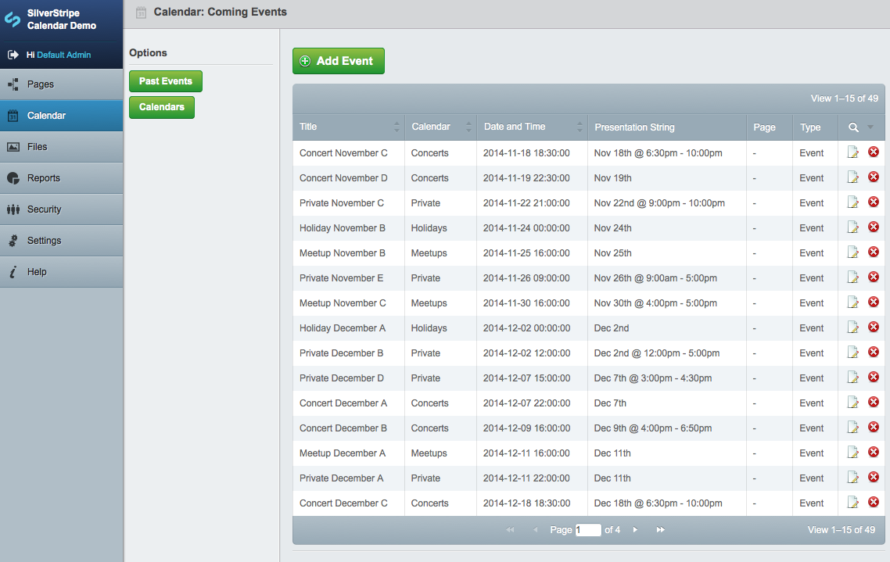
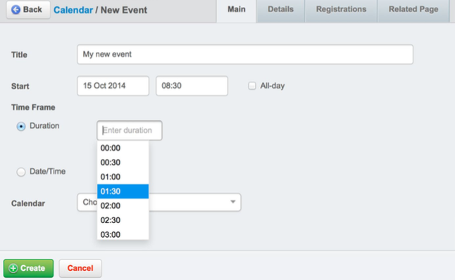
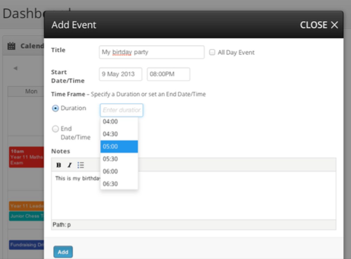
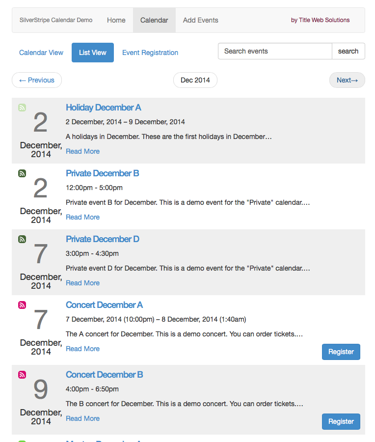
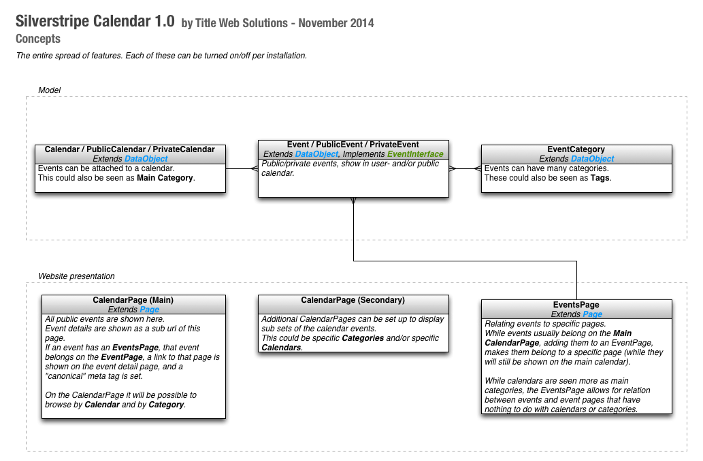

# SilverStripe Calendar

_by Title Web Solutions_

The calendar for SilverStripe 3.1 is a solid base for all your calendaring needs, 
it's built to be flexible and configurable so that it fits to most scenarios - both for 
web sites with public events, and web apps with private events - or a combination hereof.


## NOTE

This was meant to be a premium module, but as of November 2014 we decided to open source it.

If you like it, and need help setting it up, we can do that for you.
[You can contact us here](http://title.dk/contact/).   
Below you'll find a wish list of features/amendmends we'd like to implement. If you miss a feature and/or
would like to sponsor development, we're happy to do so at a discounted rate - if so, 
please [contact us](http://title.dk/contact/).

**Pull requests are very welcome!** But please, get in touch with us if you're planning
to develop a feature.

You can also join the conversation about this module on Gitter: 
[](https://gitter.im/titledk/silverstripe-calendar?utm_source=badge&utm_medium=badge&utm_campaign=pr-badge)

## Demo

There's a demo site available on <http://calendar.demo.title.dk>.    
_On the demo site you can read more about the features, with practical examples._

The code for the demo is available at <https://github.com/titledk/silverstripe-calendar-demo>.    
If you plan to use the calendar, start out installing this!

## Compatibility

* For SilverStripe `3.1.x`: tag `1.0.1`
* For SilverStripe `3.2.x`: branch `1.0` / tag `1.1`

For tested versions check out the [Calendar demo](https://github.com/titledk/silverstripe-calendar-demo#compatibility)


## This module in the wild

The module is used on the following sites:

* <http://texasbeefcheckoff.com/resources/calendar/>
* <http://v2.bartonvilletc.com/events/>

_Are you using this module on your site? Let us know!_

## Features

* Extensible. Customize it any way you want, while the basic concepts are taken care of.
* Solid, opinionated models.
* Event/Calendar/Category relations allowing complex filtering.
* Public/Private events.
* All features are configurable, so if you only need the basics, you can turn the rest off.
* Comprehensive calendar/event administration.
* JavaScript enhanced edit event form, usable both on frontend and backend, with date picker, 
time picker and dropdown, and duration dropdown, still allowing manual inputs
* Listing of events on the frontend through the CalendarPage
* Frontend calendar view, using the fullcalendar jQuery plugin
* Event Registrations (this might be moved to an external module)
* Calendar colors with configurable color options, and JS color palette field 
(works on both frontend and backend) - shading calendars allow for holiday calendars etc. to appear in the background
* No default frontend styling.
* Composer based workflow. You’ll be able to add and update the module using Composer.


## Weak points at the moment

* The event model and administration is solid, but is missing recurring events
	* See the bottom of this readme file for our "wishlist"
* Frontend templates
	* The demo is overwriting much of the templates in the calendar
		* Includes should be more generic
	* preferably we should have a `Bootstrap` and a `Foundation` module
	for these
* Frontend styling
	* Would be nice with some easy-to-include Sass mixins
* Registrations
	See also [this discussion](https://gitter.im/jedateach/silverstripe-eventmanagement) on event registrations


## Contributors

* [Anselm Christophersen](https://github.com/anselmdk)
* [Colin Burns](https://github.com/colinburns)


## License

MIT

## Installation

Add at least the following to your project `_config.php`:

```php
CalendarConfig::init();
```

See `CalendarConfig` on how to configure the module.


## Screenshots

### CMS





### Frontend






## Illustrations

Illustrations for the calendar structure are done in Omnigraffle.    
The Omnigraffle document is part of this repository, under `docs/img/silverstripe-calendar.graffle`.


### Concepts

This illustration outlines the basic calendar concepts:





### Structure

Current and planned structure (some of this might be moved to external repositories):


### Plan: Private Calendars

NOTE: Parts of this is already developed, so please contact us if you're planning
to work on this.


### Plan: Shared Calendars


## Roadmap/Ideas/Plans


### Wish List

* Recurring events
* Unit tests
* Make everything translatable


### Possible Improvements

* Structure
	* consider using ss 3.1 config system
	* consider implementing the `EventInterface`, allowing everything to act as an event
	* hiding page types that are not enabled via the settings
		* see [here](http://www.balbus.tk/hide-a-page-from-the-cms-pagetype-dropdown/) for a reference
	* remove SS3.0 compatibility to make support for SS3.1 easier (make sure to make a tag w. SS3.0 compatibility)
* Backend
	* Implement event search in sidebar (see `CMSMAin->SearchForm()`)
	* Dashboard panel to display individual calendars' coming events, and jump to creation form
	* Backend usability review (together with concept review)
* Frontend
	* template structure
		* go through includes and layout templates and see how they fit as building blocks
	* Change `EventPage` to be a `DataExtension`, and call it `EventsPage`. (We might need an update script for this.)

## Versioning

We're trying to stick to the [Semantic Versioning](http://semver.org)
paradigm. That is: 

> Consider a version format of X.Y.Z (Major.Minor.Patch). Bug fixes not affecting the API increment the patch version, 
backwards compatible API additions/changes increment the minor version, and backwards incompatible API changes 
increment the major version.

So:

* Go for the `Master` branch, if you want to live on the edge
* Go for the `1.0` branch if you want minor changes and patches
* Go for the tags (`1.0.0` and following), if you only want the actual releases

**NOTE:** If you think I'm missing something here, please let me know, @anselmdk on twitter, or through
this repo's chat on [Gitter](https://gitter.im/titledk/silverstripe-calendar).


